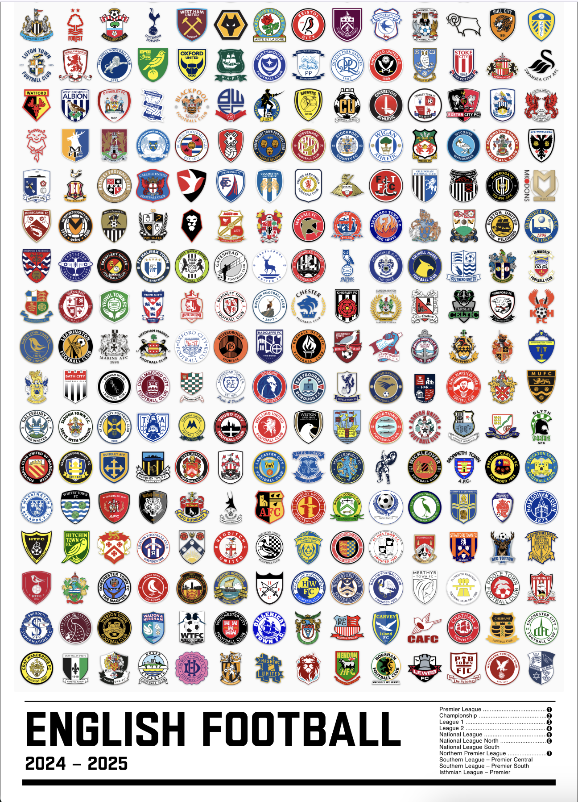

# efl-poster

When I was in high school I made a big poster with five tiers of English Football League clubs. It involved a ton of manual copy / paste into photoshop. It took days to complete. I decided to revisit the project, double the number of clubs and automate the process for future years.

This repo contains utility scripts to fetch badges from English Football League clubs and generates a poster from the output.

## Scripts 

`fetch-leagues.py`

Scrapes wikipedia pages for league pyramid using URLs and selectors from leagues.json config. Makes it easy to regenerate new positions after a promotion / relegation cycle.

`fetch-teams.py`

Scrapes wikipedia pages for team metadata and badge images. Uses team links found from leagues.json.

`generate-poster.py`

Creates HTML file with scraped logos layed out in movie size (27" x 40") poster. 

You can use Chrome's builtin full-page screenshot command to save a ready-to-print version. `Dev tools > Cmd-P > type ">" > Select Capture full size screenshot`.

